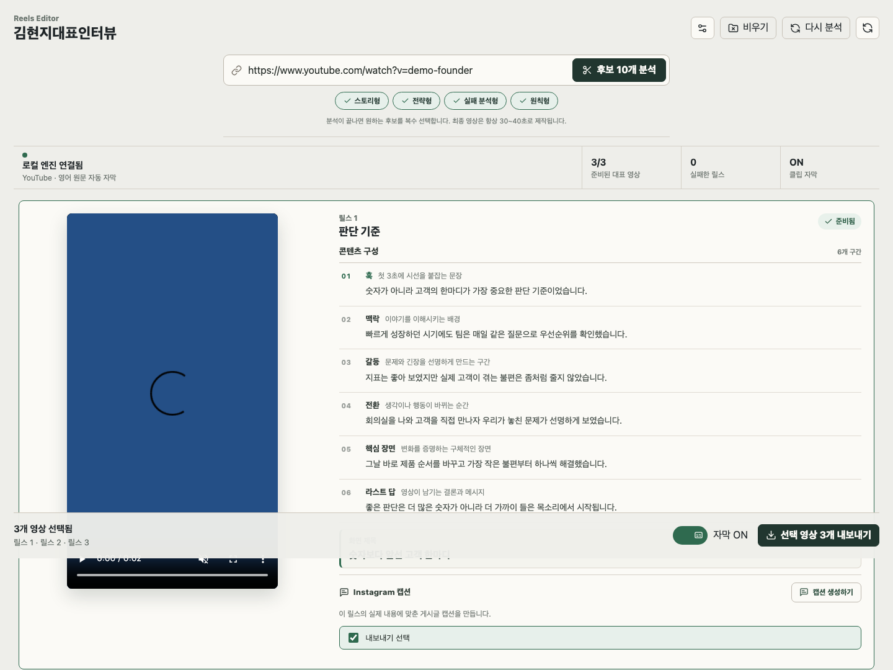
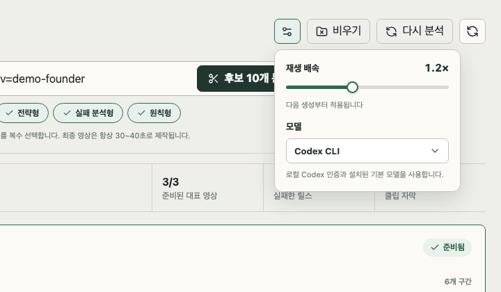

<div align="center">

# Reels Editor

**한 시간짜리 창업가 인터뷰를 내 컴퓨터에서 숏폼 릴스로 만듭니다.**

[](https://github.com/jdh4601/reels-editor/actions/workflows/ci.yml)
[](LICENSE)
[](https://www.python.org/downloads/)
[](#준비물)

[English README](README.md) · [변경 이력](CHANGELOG.md) · [기여 안내](CONTRIBUTING.md)



</div>

---

YouTube 인터뷰 링크를 붙여넣으면 앱이 자막을 읽고, 내용이 겹치지 않는 릴스 후보
10개를 제안합니다. 그중 고른 후보만 9:16 영상으로 렌더링하며, 한국어 자막과 상단
훅 제목이 함께 들어갑니다.

모든 작업은 로컬에서 이루어집니다. 영상과 자막, 렌더링 결과는 전부 사용자 컴퓨터에
남고, 외부로 나가는 것은 선택한 모델 제공자에게 보내는 자막 텍스트뿐입니다.

## 왜 만들었나

긴 인터뷰에서 숏폼을 뽑는 일은 편집보다 판단에 가깝습니다. 공유할 만한 90초를
찾으려고 한 시간을 봐야 하고, 겨우 찾고 나면 그때부터 자르고 자막을 넣고 제목을
다는 작업이 남습니다.

이 도구는 그 과정을 둘로 나눕니다. 읽는 일은 앱이 맡아 근거와 함께 후보를
제안하고, 어떤 후보를 만들 가치가 있는지는 사람이 판단합니다. 판단이 끝나면 자르는
일은 다시 앱이 맡습니다.

## 다른 도구와 다른 점

**한 문장도 바꾸어 쓰지 않습니다.** 자막은 원문 자막 그대로입니다. 모델은 구간을
삭제하고 순서를 바꿀 수만 있고, 어미나 조사 하나도 고쳐 쓸 수 없습니다. 큰따옴표가
열리면 그것이 닫히는 구간까지 반드시 포함합니다. 모델이 새로 쓰는 텍스트는 제목
하나뿐입니다.

**후보마다 근거가 붙습니다.** 제안된 열 개는 각각 어떤 자막 구간에서 나왔는지를
명시합니다. 렌더링에 시간을 쓰기 전에 근거를 확인할 수 있습니다.

**제목은 요약문이 아니라 텍스트 훅입니다.** 조사를 전부 갖춘 완결 문장은 시청자가
스크롤하는 속도보다 느리게 읽힙니다. 그래서 제목은 공백을 제외하고 14자로 제한하고
명사구를 우선합니다. 규칙은
[`prompts/text-hook-principles.md`](prompts/text-hook-principles.md)에 있으며,
길이를 넘긴 제목은 검증에서 걸러져 다시 생성됩니다.

**모델은 직접 고릅니다.** Codex CLI, Claude Code CLI, OpenAI API, Kimi, 그리고
OpenAI 호환 서버를 지원합니다.

## 준비물

macOS와 아래 도구가 필요합니다.

| 도구 | 용도 | 설치 |
| --- | --- | --- |
| Python 3.11 이상 | 앱 실행 | [python.org](https://www.python.org/downloads/) |
| ffmpeg, ffprobe | 영상 컷과 렌더링 | `brew install ffmpeg` |
| Pretendard | 제목과 자막에 쓰는 글꼴 | `brew install --cask font-pretendard` |
| 모델 제공자 | 자막을 읽고 구성안을 작성 | [모델 제공자](#모델-제공자) 참고 |

설치되었는지 확인합니다.

```bash
python3 --version && ffmpeg -version | head -1 && ffprobe -version | head -1
```

## 설치

```bash
git clone https://github.com/jdh4601/reels-editor.git
cd reels-editor

python3 -m venv .venv
.venv/bin/pip install -e ".[dev]"

cd desktop/ui && npm install && npm run build && cd ../..
```

모델 제공자를 준비합니다. 기본값은 Codex CLI입니다.

```bash
npm install -g @openai/codex
codex login
```

앱을 실행합니다.

```bash
.venv/bin/reels-editor-desktop
```

## 사용법

1. 창업가 롱폼 인터뷰의 YouTube 링크를 붙여넣습니다.
2. 스토리형·전략형·실패 분석형·원칙형 중 원하는 유형을 하나 이상 선택합니다.
3. `후보 10개 분석`을 누릅니다. 앱이 영상과 자막을 내려받고, 서로 겹치지 않는 후보
   10개를 보여줍니다.
4. 만들고 싶은 후보를 골라 `선택한 후보로 릴스 생성`을 누릅니다. 고른 후보만
   30~40초 영상으로 렌더링됩니다.
5. `캡션 생성하기`를 누르면 그 릴스의 실제 대본을 근거로 Instagram 캡션을
   작성합니다.
6. 내보낼 영상을 고르고 `선택 영상 내보내기`를 누릅니다.

자막을 켜고 끌 때는 전체 영상을 다시 만들지 않고 오버레이만 다시 렌더링합니다.

같은 인터뷰에서 후보를 다시 뽑고 싶다면 `다시 분석`을 누릅니다.

### 자막 처리

앱은 YouTube가 제공하는 자막만 사용하고, 음성 인식으로 몰래 대체하지 않습니다.
영어 수동 자막을 가장 먼저 쓰고, 없으면 영어 자동 생성 자막을, 그다음으로 영상이
제공하는 다른 자막을 씁니다. 자막이 전혀 없는 영상은 조용히 넘어가지 않고 자막이
필요하다는 오류를 표시합니다.

영어 원문은 한국어 자막으로 번역하되 숫자와 고유명사, 사실관계는 그대로 보존합니다.

## 모델 제공자

설정에서 고르거나 `~/.config/reels-editor/config.yaml`을 직접 수정합니다.

```yaml
provider: codex-cli
model: gpt-5.6-sol
style: {}
```

| 제공자 | `provider` 값 | 인증 |
| --- | --- | --- |
| OpenAI Codex CLI | `codex-cli` | `codex login` |
| Claude Code CLI | `claude-cli` | `claude` 로그인 |
| OpenAI API | `openai` | `OPENAI_API_KEY` |
| Kimi | `kimi` | `MOONSHOT_API_KEY` |
| OpenAI 호환 서버 | `custom` | `REELS_LLM_API_KEY` |



## 앱 파일로 빌드하기

```bash
.venv/bin/pyinstaller desktop/pyinstaller/reels_editor_desktop.spec --noconfirm
open "dist/Reels Editor.app"
```

일반 macOS 앱처럼 설치합니다.

```bash
ditto "dist/Reels Editor.app" "/Applications/Reels Editor.app"
```

서명과 공증을 하지 않은 빌드입니다. macOS가 처음 실행을 막으면 Finder에서 앱을
Control-클릭하고 `열기`를 선택합니다.

## 파일이 저장되는 위치

| 무엇 | 어디에 |
| --- | --- |
| 작업 상태, 내려받은 영상, 자막, 렌더링 중간 파일 | `~/Library/Application Support/reels-editor/jobs/` |
| 설정 | `~/.config/reels-editor/config.yaml` |
| 내보낸 MP4 | 저장 대화상자에서 고른 위치 |

같은 영상을 다시 작업하면 기존에 내려받은 파일을 재사용합니다. 기준은 YouTube 영상
ID이므로 `youtu.be/…`와 `watch?v=…`처럼 링크 형식이 달라도 같은 영상이면 다시
내려받지 않습니다.

## CLI

`edl.json`을 직접 고친 뒤 작업 폴더를 다시 렌더링합니다.

```bash
.venv/bin/reels-editor render out/<프로젝트명-날짜>/s1
```

## 문제 해결

<details>
<summary><b>앱이 Codex나 ffmpeg를 찾지 못합니다</b></summary>

터미널에서 먼저 확인합니다.

```bash
codex --version && ffmpeg -version | head -1
```

Finder에서 실행해도 앱은 `~/.npm-global/bin`, `~/.local/bin`,
`/opt/homebrew/bin`, `/usr/local/bin`을 자동으로 `PATH`에 넣습니다. 그 밖의 위치에
설치한 도구는 찾지 못합니다.
</details>

<details>
<summary><b>영상 다운로드나 자막 추출이 실패합니다</b></summary>

- 재생목록이 아니라 개별 영상 링크인지 확인합니다.
- 비공개·연령 제한·로그인이 필요한 영상은 내려받지 못할 수 있습니다.
- 영상에 자막이 실제로 있는지 확인합니다.
- YouTube 형식이 바뀐 경우 `pip install -U yt-dlp`로 다운로드 모듈을 갱신합니다.
</details>

<details>
<summary><b>빌드가 실패합니다</b></summary>

Python과 UI 양쪽 의존성을 다시 설치합니다.

```bash
.venv/bin/pip install -e ".[dev]"
cd desktop/ui && npm install && npm run build && cd ../..
```
</details>

## 개발 검증

```bash
PYTEST_DISABLE_PLUGIN_AUTOLOAD=1 .venv/bin/python -m pytest

cd desktop/ui
npm run typecheck
npm run build
npm run test:dashboard
```

`npm run test:dashboard`는 Playwright로 세 가지 창 크기에서 대시보드를 실제로
띄워 요소가 겹치지 않는지 검사하고, 스크린샷을
`desktop/ui/test-results/dashboard/`에 남깁니다.

코드 구조는 [CONTRIBUTING.md](CONTRIBUTING.md)에 정리되어 있습니다.

## 다루는 영상에 대하여

사용 권한이 있는 영상만 내려받고 게시하세요. 이 도구는 권한을 대신 확인해 주지
않습니다.

## 라이선스

[MIT](LICENSE) © DongHyun Jung
