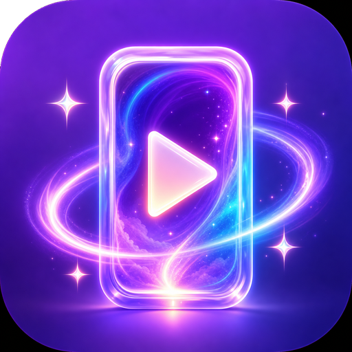

<div align="center">



# Reels Editor

**한 시간짜리 창업가 인터뷰를 내 컴퓨터에서 숏폼 릴스로 만듭니다.**

[](https://github.com/jdh4601/reels-editor/actions/workflows/ci.yml)
[](LICENSE)
[](https://www.python.org/downloads/)
[](#준비물)

[English README](README.md) · [변경 이력](CHANGELOG.md) · [기여 안내](CONTRIBUTING.md)

</div>

---

YouTube 인터뷰 링크를 붙여넣으면 앱이 자막을 읽고, 내용이 겹치지 않는 릴스 후보
10개를 제안합니다. 그중 고른 후보만 9:16 영상으로 렌더링하며, 한국어 자막과 상단
훅 제목이 함께 들어갑니다.

모든 작업은 로컬에서 이루어집니다. 영상과 자막, 렌더링 결과는 전부 사용자 컴퓨터에
남고, 외부로 나가는 것은 선택한 모델 제공자에게 보내는 자막 텍스트뿐입니다.

## 왜 만들었나

긴 인터뷰에서 숏폼을 뽑는 일은 편집보다 판단에 가깝습니다. 공유할 만한 90초를
찾으려고 한 시간을 봐야 하고, 겨우 찾고 나면 그때부터 자르고 자막을 넣고 제목을
다는 작업이 남습니다.

이 도구는 그 과정을 둘로 나눕니다. 읽는 일은 앱이 맡아 근거와 함께 후보를
제안하고, 어떤 후보를 만들 가치가 있는지는 사람이 판단합니다. 판단이 끝나면 자르는
일은 다시 앱이 맡습니다.

## 다른 도구와 다른 점

**한 문장도 바꾸어 쓰지 않습니다.** 자막은 원문 자막 그대로입니다. 모델은 구간을
삭제하고 순서를 바꿀 수만 있고, 어미나 조사 하나도 고쳐 쓸 수 없습니다. 큰따옴표가
열리면 그것이 닫히는 구간까지 반드시 포함합니다. 모델이 새로 쓰는 텍스트는 제목
하나뿐입니다.

**후보마다 근거가 붙습니다.** 제안된 열 개는 각각 어떤 자막 구간에서 나왔는지를
명시합니다. 렌더링에 시간을 쓰기 전에 근거를 확인할 수 있습니다.

**제목은 요약문이 아니라 텍스트 훅입니다.** 제목 후보 10개는 공백 제외 12~24자,
자연스럽게 띄어쓴 3어절 이상이어야 합니다. 지나치게 짧거나 붙여 쓴 제목은 검증에서
걸러 다시 생성합니다. 규칙은
[`prompts/text-hook-principles.md`](prompts/text-hook-principles.md)에 있으며,
조건을 벗어난 제목은 검증에서 걸러져 다시 생성됩니다.

**2줄 제목은 위계를 분명히 나눕니다.** 첫 줄은 작은 흰색 전제 문구로, 둘째 줄은
기존처럼 크고 주황색인 핵심 훅으로 표시합니다.

**와이드 샷은 발화자를 따라갑니다.** macOS의 Apple Vision이 로컬에서 얼굴과 입의
움직임을 분석합니다. 2인 화면에서 발화자가 잘릴 때 해당 인물 쪽으로 크롭을 이동하고
과하지 않은 확대를 적용합니다.

**모델은 직접 고릅니다.** Codex CLI, Claude Code CLI, OpenAI API, Kimi, 그리고
OpenAI 호환 서버를 지원합니다.

## 준비물

macOS와 아래 도구가 필요합니다.

| 도구 | 용도 | 설치 |
| --- | --- | --- |
| Python 3.11 이상 | 앱 실행 | [python.org](https://www.python.org/downloads/) |
| ffmpeg, ffprobe | 영상 컷과 렌더링 | `brew install ffmpeg` |
| Pretendard | 제목과 자막에 쓰는 글꼴 | `brew install --cask font-pretendard` |
| 모델 제공자 | 자막을 읽고 구성안을 작성 | [모델 제공자](#모델-제공자) 참고 |

설치되었는지 확인합니다.

```bash
python3 --version && ffmpeg -version | head -1 && ffprobe -version | head -1
```

## 설치

```bash
git clone https://github.com/jdh4601/reels-editor.git
cd reels-editor

python3 -m venv .venv
.venv/bin/pip install -e ".[dev]"

cd desktop/ui && npm install && npm run build && cd ../..
```

모델 제공자를 준비합니다. 기본값은 Codex CLI입니다.

```bash
npm install -g @openai/codex
codex login
```

앱을 실행합니다.

```bash
.venv/bin/reels-editor-desktop
```

## 사용법

상단의 `새 탭`을 눌러 최대 3개의 서로 다른 YouTube URL을 병렬로 처리할 수 있습니다. 각 탭은 URL, 에피소드 번호, 후보 선택, 생성 진행 상태를 따로 유지합니다. 처리 중인 탭은 작업이 끝난 후 닫을 수 있습니다.

1. 창업가 롱폼 인터뷰의 YouTube 링크를 붙여넣습니다.
2. 스토리형·전략형·실패 분석형·원칙형 중 원하는 유형을 하나 이상 선택합니다.
3. `후보 10개 분석`을 누릅니다. 앱이 자막만 내려받아 분석하고, 서로 겹치지 않는 후보
   10개를 보여줍니다.
4. 만들고 싶은 후보를 골라 `선택한 후보로 릴스 생성`을 누릅니다. 대본에 필요한 영상·오디오 구간만 내려받아
   고른 후보를 20~40초 영상으로 렌더링합니다.
5. 제목 편집의 `후보 5개 생성`을 누르면 추천 순서로 제목 5개를 한 번에 만듭니다.
   원하는 후보를 선택하고 `수정하기`를 누르면 영상에 반영됩니다.
   `캡션 생성하기`를 누르면 그 릴스의 실제 대본을 근거로 Instagram 캡션을
   약 300자로 정리하고, 요약 뒤에는 화자·주제·댓글 키워드·정리 자료를 안내하는 문구를 붙입니다.
   영상 출처는 캡션의 맨 마지막 줄에 표시합니다.
   댓글 키워드를 ManyChat의 해당 게시물 트리거로 등록하고 안내한 자료를 연결합니다.
   `아이폰 메모장에 복사`를 누르면 첫 제목 줄을 제외한 캡션 본문을
   Mac 메모의 iCloud 계정에 있는 `릴스 캡션` 폴더에 저장합니다.
6. 설정에서 Google Drive 안의 MP4 저장 폴더를 선택합니다.
   내보낼 영상을 고르고 `선택 영상 내보내기`를 누릅니다.

내보낸 MP4는 Google Drive의 기존 `릴스(에피소드)` 폴더에 바로 저장됩니다.
`My Drive`나 `릴스(에피소드)`를 선택하면 기존 폴더를 찾아 사용합니다. 같은 이름의
파일이 있으면 파일명에 `(2)`, `(3)`를 붙여 기존 영상을 보존합니다. 렌더 완료본을 유지하는
앱 내부 보관 폴더와 Google Drive 내보내기 폴더는 서로 분리되며, 앱의 과거 릴스는
완료 후 7일 동안 다시 열고 수정할 수 있습니다.

최초 저장 때 Reels Editor가 메모 앱을 제어하도록 자동화 권한을 허용해야 합니다.
Mac과 iPhone에서 같은 Apple 계정을 사용하고 iCloud 메모 동기화를 켜면 생성된
캡션이 iPhone 메모 앱에 자동으로 나타납니다.

첫 렌더는 크롭·제목·자막·로고 합성과 최종 MP4 인코딩을 하나의 FFmpeg 패스로
처리합니다. 제목이나 자막을 수정하면 내려받은 원본, 크롭 계획, 얼굴 분석 결과,
생성된 PNG 에셋을 재사용하며 H.264 중간 영상을 다시 인코딩하고 디코딩하지 않습니다.

기준 M4 Pro에서는 전체 1080×1920 CPU 필터 그래프를 실측했을 때 VideoToolbox보다
`libx264 -preset veryfast`가 빨라 기본값으로 유지했습니다. 다른 Mac에서 하드웨어
인코더를 비교하려면 다음처럼 실행할 수 있습니다.

```bash
REELS_EDITOR_VIDEO_ENCODER=h264_videotoolbox .venv/bin/reels-editor-desktop
```

VideoToolbox를 실행할 수 없으면 자동으로 `libx264`로 재시도합니다. 하드웨어 최종
인코딩은 1개씩 처리하되 여러 릴스의 분석은 계속 병렬로 수행합니다.

같은 인터뷰에서 후보를 다시 뽑고 싶다면 `다시 분석`을 누릅니다.

### 자막 처리

앱은 YouTube가 제공하는 자막만 사용하고, 음성 인식으로 몰래 대체하지 않습니다.
영어 수동 자막을 가장 먼저 쓰고, 없으면 영어 자동 생성 자막을, 그다음으로 영상이
제공하는 다른 자막을 씁니다. 자막이 전혀 없는 영상은 조용히 넘어가지 않고 자막이
필요하다는 오류를 표시합니다.

영어 원문은 한국어 자막으로 번역하되 숫자와 고유명사, 사실관계는 그대로 보존합니다.

## 모델 제공자

설정에서 고르거나 `~/.config/reels-editor/config.yaml`을 직접 수정합니다.

```yaml
provider: codex-cli
model: gpt-5.6-sol
style: {}
```

| 제공자 | `provider` 값 | 인증 |
| --- | --- | --- |
| OpenAI Codex CLI | `codex-cli` | `codex login` |
| Claude Code CLI | `claude-cli` | `claude` 로그인 |
| Google Gemini CLI | `gemini-cli` | `gemini` 로그인 |
| OpenAI API | `openai` | `OPENAI_API_KEY` |
| Kimi | `kimi` | `MOONSHOT_API_KEY` |
| OpenAI 호환 서버 | `custom` | `REELS_LLM_API_KEY` |

## 앱 파일로 빌드하기

```bash
.venv/bin/pyinstaller desktop/pyinstaller/reels_editor_desktop.spec --noconfirm
open "dist/Reels Editor.app"
```

일반 macOS 앱처럼 설치합니다.

```bash
ditto "dist/Reels Editor.app" "/Applications/Reels Editor.app"
```

서명과 공증을 하지 않은 빌드입니다. macOS가 처음 실행을 막으면 Finder에서 앱을
Control-클릭하고 `열기`를 선택합니다.

## 파일이 저장되는 위치

| 무엇 | 어디에 |
| --- | --- |
| 작업 상태, 내려받은 영상, 자막, 렌더 에셋, 로컬 얼굴 분석 캐시 | `~/Library/Application Support/reels-editor/jobs/` |
| 설정 | `~/.config/reels-editor/config.yaml` |
| 내보낸 MP4 | `~/Movies/Reels Editor Exports/` 아래 실행별 폴더 |

같은 영상의 자막, 내려받은 구간과 후보 분석 결과는 `jobs/.source-cache/`에 공유 저장합니다.
YouTube 영상 ID가 같으면 링크의 공유·시간 매개변수가 달라도 재사용하며, 여러 탭의
중복 다운로드·분석도 방지합니다. 자막 내용, 콘텐츠 유형, AI 제공자·모델·서버 주소 또는
분석 프롬프트가 바뀌면 후보를 다시 분석합니다. 대본 생성은 선택마다 새로 실행합니다.
기존에 내려받은 전체 원본이 있으면 구간을 다시 받지 않고 재사용합니다. 공유 캐시는
작업 삭제 후에도 유지됩니다. 필요하면 앱을 종료한 뒤 `.source-cache/`를 삭제할 수 있습니다.

## CLI

`edl.json`을 직접 고친 뒤 작업 폴더를 다시 렌더링합니다.

```bash
.venv/bin/reels-editor render out/<프로젝트명-날짜>/s1
```

## 문제 해결

<details>
<summary><b>앱이 Codex나 ffmpeg를 찾지 못합니다</b></summary>

터미널에서 먼저 확인합니다.

```bash
codex --version && ffmpeg -version | head -1
```

Finder에서 실행해도 앱은 `~/.npm-global/bin`, `~/.local/bin`,
`/opt/homebrew/bin`, `/usr/local/bin`을 자동으로 `PATH`에 넣습니다. 그 밖의 위치에
설치한 도구는 찾지 못합니다.
</details>

<details>
<summary><b>영상 다운로드나 자막 추출이 실패합니다</b></summary>

- 재생목록이 아니라 개별 영상 링크인지 확인합니다.
- 비공개·연령 제한·로그인이 필요한 영상은 내려받지 못할 수 있습니다.
- 영상에 자막이 실제로 있는지 확인합니다.
- YouTube 형식이 바뀐 경우 `pip install -U yt-dlp`로 다운로드 모듈을 갱신합니다.
</details>

<details>
<summary><b>빌드가 실패합니다</b></summary>

Python과 UI 양쪽 의존성을 다시 설치합니다.

```bash
.venv/bin/pip install -e ".[dev]"
cd desktop/ui && npm install && npm run build && cd ../..
```
</details>

## 개발 검증

```bash
PYTEST_DISABLE_PLUGIN_AUTOLOAD=1 .venv/bin/python -m pytest

cd desktop/ui
npm run typecheck
npm run build
npm run test:dashboard
```

`npm run test:dashboard`는 Playwright로 세 가지 창 크기에서 대시보드를 실제로
띄워 요소가 겹치지 않는지 검사하고, 스크린샷을
`desktop/ui/test-results/dashboard/`에 남깁니다.

코드 구조는 [CONTRIBUTING.md](CONTRIBUTING.md)에 정리되어 있습니다.

## 다루는 영상에 대하여

사용 권한이 있는 영상만 내려받고 게시하세요. 이 도구는 권한을 대신 확인해 주지
않습니다.

## 라이선스

[MIT](LICENSE) © DongHyun Jung
